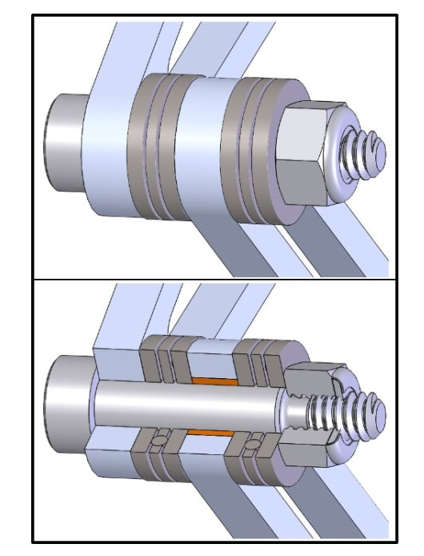
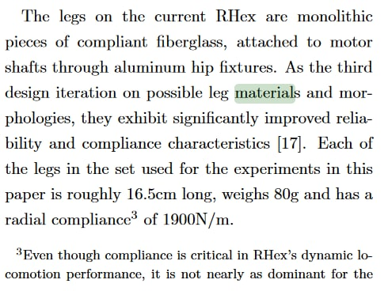

# Strirus legs

## 5-bar linkage
* Open [Leg design](./Leg.iam) in Autodesk Inventor
* Exploded view [video](./README/explode.wmv)
* [Alternative 1](https://github.com/Nate711/StanfordDoggoProject#joints)
* [Alternative 2](https://static1.squarespace.com/static/542ddec8e4b0158794bd1036/t/584addc52994ca5866274be3/1481301453183/gait-development-direct.pdf?#page=6)

## C-legs
* [src](https://journals.sagepub.com/doi/10.1177/0278364904045594)

